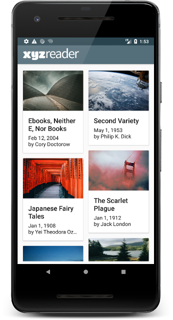
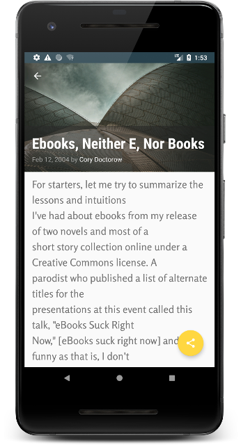

### :small_blue_diamond: Project Year: 2018 :small_blue_diamond:
#### (Udacity Android Developer Nanodegree Project 5)
# XYZ Reader: Android App for RSS Feeds
### Transformed the user experience of a news reading app using Material Design principles. This includes consistent and meaningful use of Material Design UI components, fonts, color, motion and surfaces.
---

* Technologies: Java, XML
* Platform Features: Material Design, Card View, Constraint Layout
* Libraries: OkHttp, Android Support Design
* Tools and OS : Android Studio, Ubuntu
* Platform: Android 4.1+
* Modules: Remote, UI, Data
* Lines of Code:  1860
* Duration: 1 Week (FEB 2018)

### Screenshots

